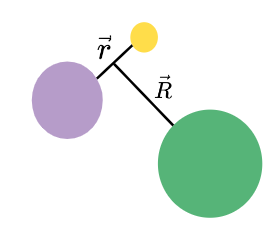
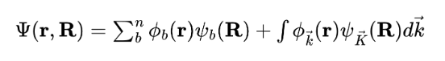
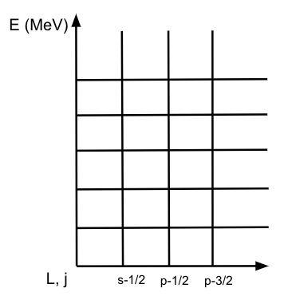
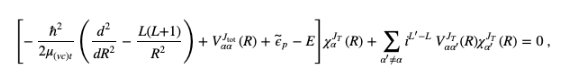

# Continuum Discretized Coupled Channel Method

This page explains key details of the method used in the calculation which this workflow performs. The Continuum Discretized Coupled Channels method, 
or CDCC, is used to solve nuclear reactions in which breakup of the projectile occurs. The coordinate system for this reaction is shown below. 

Based on this three body system, this means that the three body Schrodinger equation needs to be solved in order to obtain reaction observables.
The tricky component with breakup is that instead of there being 
only bound states, the wave function for the projectile now has continuous and bound state components as shown below. 

In CDCC, the continous component is dealt with by discretizing the continuum. The continuum is discretized by the angular momentum included in the 
problem, and the allowable relative energy between the core and valence parts of the projectile. This splits the continuum into a gridspace, and 
example of which is shown below. 

Inside each bin, there many scattering states. In CDCC, the averaging method is used to take a superposition of these scattering states, and this 
averaged radial wave function is used in solving the coupled channels problem, the equation for which is shown below. 

Above, alpha and alpha prime denote different channels. The bracketed term can be thought of as the elastic scattering term, and the second term 
represents all reaction channels for which the physics in the entrance channel is different from the exit channel. This 
equation is very complicated, but the good news is it is solvable numerically! The next section will give more detail on a program called Fresco, 
which solves coupled channel nuclear reaction problems numerically. 

 

