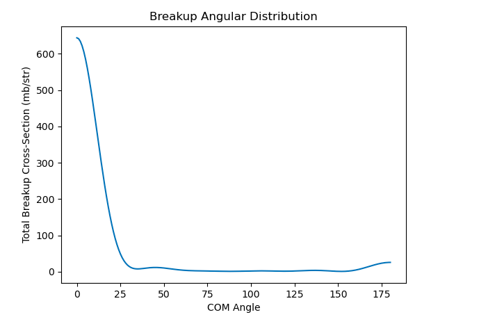

The github repository located [here](https://github.com/cgbeckman/CMSE890Project.git) contains this 
fully 
implemented workflow for carbon-15 scattering on deuteron. 

The input file is set up for the reaction information. The goal of the calculation is to determine the 
elastic scattering angular distribution for carbon-15 scattering on a deuterium target. 

First, ensure snakemake is installed where the workflow will be run. The instructions to download 
snakemake can be found 
[here](https://snakemake.readthedocs.io/en/stable/getting_started/installation.html).

Once snakemake is installed where the workflow will be ran, clone the repository using "git clone 
https://github.com/cgbeckman/CMSE890Project.git".

The reaction information is all set in the input file, which is located in workflow/input/example-br.in. 
This means that we are ready to run the calculation. 

To run the calculation, there are two methods. The first is to run snakemake in the command line. To do 
so, navigate to "workflow/". Then in the command line run "snakemake". 

The second option is for running the calculation on a system which uses slurm job submission. Navigate 
to the directory "workflow". In this directory is a file called "run_workflow.sb". To submit the entire 
workflow to run on hpcc, enter the command "sbatch run_workflow.sb" on the command line. This example 
only takes ~5 seconds to run, and the resulting slurm file will be stored in "workflow/slurm_files". The 
output files will be stored in "workflow/outputs".

To view the resulting energy integrated angular distribution, and angle integrated energy distribution, 
navigate to the plots directory stored in "workflow/outputs/plots/". Any graphical viewer can be used to 
view the plots. Below is what the result should look like. 

The angle integrated energy distribution should match the following result. 

