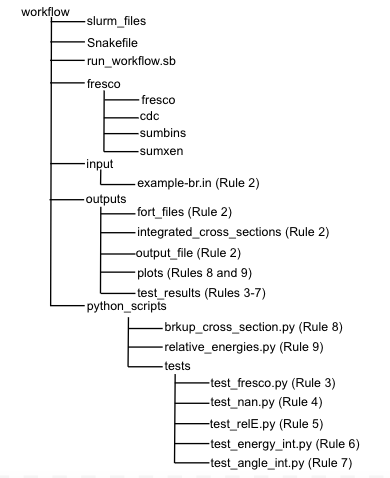

# Workflow 

Snakemake is used to execute the Fresco calculation, and plot the results. In snakemake, this is done 
using rules which are contained in a Snakefile. The structure of the Snakefile is explained below. 

**1. Rule All**: The first rule in the snakefile contains all the target outputs in the Snakefile. The 
outputs for each rule are included here, so that when snakemake runs it knows what targets it is looking for.  
**2. Run Fresco**: The second rule runs the Fresco calculation, using the command line. The secondary 
functions, 
the angular and energy integration, are also performed with this rule. All output 
files are moved, using the command line, to directories for organizational purposes. 
**3. Test Fresco**: The next 5 rules test that the calculation ran properly. This first rule tests that 
the 
fort.16 file was created. If the calculation failed, this file will not generate. Other 
fort files will generate for a failed calculation, which is why fort.16 was chosen for the 
test.  
**4. Test Fort.16 NaN**: The next rule tests that the output in the fort.16 file are real results. 
Sometimes 
there can be errors in the input file which don't cause the calculation to fail, but 
will result in NaN cross sections.   
**5. Test Fort.13 NaN**: This rule similarily tests that the output of the fort.13 file is not NaN.   
**6. Test Energy Integration**: This file checks that the energy integration worked, by ensuring floats 
are 
recorded in the corresponding output file. When the integration does not work the most common sign is that this output file is empty.   
**7. Test Angle Integration**: Similarily to the energy integration test, this rule checks that floats 
are located in the corresponding output file.  
**8. Plot the Breakup Cross-Section**: This rule calls a python script, located in the directory 
python_scripts to plot the result of the energy integration. This gives the elastic scattering angular 
distribution.  
**9. Plot the Relative Energy Distribution**: This rule calls a python script, located in the directory 
python_scripts to plot the result of the angular integration.   

The workflow directory is organized as shown below. 

The next section provides more detail on the example provided in the github repository. 
